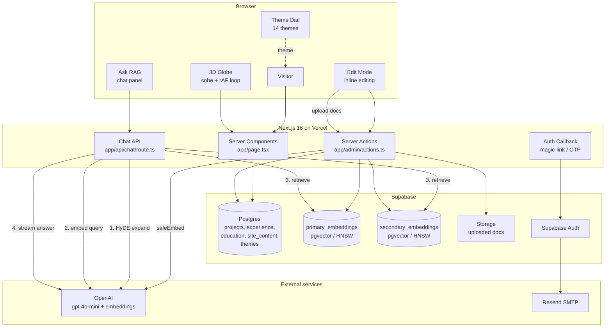

<div align="center">

# [Rithvik.ai](https://rithvik.ai)

**A personal portfolio that doubles as a live, editable, AI-powered playground.**

[](https://nextjs.org/)
[](https://react.dev/)
[](https://www.typescriptlang.org/)
[](https://tailwindcss.com/)
[](https://supabase.com/)
[](https://vercel.com/)

[**Visit the live site →**](https://rithvik.ai)

</div>

---

## Demo

<!--
  PLACEHOLDER — replace with a real screen recording of the site in action.
  GitHub renders an uploaded .mp4 as an inline player. For true autoplay,
  a looping muted .mp4 (via the <video> tag below) or a .gif works best.
  Drop the file in docs/assets/ and update the path.
-->

<div align="center">

<video src="docs/assets/demo.mp4" autoplay loop muted playsinline width="800">
  Your browser does not support the video tag.
  <a href="docs/assets/demo.mp4">Watch the demo video</a>
</video>

_<sub>Placeholder: add `docs/assets/demo.mp4` (looping, muted) — or a `docs/assets/demo.gif` fallback.</sub>_

</div>

---

## Overview

**Rithvik.ai** is my personal portfolio — a one-stop showcase of who I am, what I've built, and how I work. But it's also an experiment: rather than a static résumé page, the entire site is **live-editable in place** by me, **themable on the fly** by any visitor, and **answerable by an AI chatbot** trained on its own content.

The goal was to build something that is genuinely fun to use and that demonstrates real engineering depth — full-stack data flow, a retrieval-augmented generation (RAG) pipeline, passwordless auth, WebGL rendering, and a polished, animated front end — all in a single cohesive product.

**Three ideas drive the site:**

1. **It's a showcase.** Projects, experience, education, and contact info, presented cleanly.
2. **It's a CMS for one.** I can log in and edit any text on the page directly — no dashboard, no redeploy.
3. **It's a talking portfolio.** A RAG chatbot grounded in the site's own content answers visitor questions about me.

---

## Features

### Visitor-facing

- **Interactive 3D globe** — A WebGL-rendered globe (via [`cobe`](https://github.com/shuding/cobe)) in the Bento section marks the places that matter to me (home, current city, school). Markers are hover-interactive with live local-time tooltips, and the globe spins on its own animation loop.
- **14-theme live theming** — A fan-out "theme dial" lets any visitor instantly recolor the entire site. Ships with 3 custom Rithvik themes plus 11 popular editor themes (One Dark Pro, Dracula, Tokyo Night, Catppuccin Mocha, SynthWave '84, and more). Adding a new theme is a single database row — every surface re-derives its colors via CSS `color-mix()`.
- **"Ask RAG" AI chatbot** — A floating chat panel answers questions about me, streaming responses token-by-token. It's grounded in the site's actual content (see Architecture), so it doesn't hallucinate. Resizable, markdown-aware, with instant-answer starter chips.
- **Polished motion & design** — Scroll-reveal animations, kinetic text, a flickering grid, and a timeline beam — all built with `motion/react`. A first-visit "wiggle" subtly nudges visitors toward the theme dial.
- **Responsive & accessible** — Mobile-tuned layouts, `prefers-reduced-motion` support, and a no-JS fallback theme baked into the SSR output.

### Owner-facing (authenticated)

- **In-place inline editing** — Logged in, I can click any heading, paragraph, project, or tag and edit it directly on the page. Changes save on blur and persist to Postgres — no admin panel, no rebuild.
- **Globe marker editor** — An edit-mode panel to add, edit, and remove globe locations.
- **RAG knowledge management** — Upload supplementary documents (PDF, DOCX, TXT, images) that get chunked, embedded, and added to the chatbot's knowledge base. A one-click "re-embed all content" backfill keeps the AI in sync.
- **Passwordless authentication** — Email OTP + magic-link login (via Supabase Auth + Resend SMTP). No passwords stored or used.

### Engineering niceties

- **Self-syncing AI** — Every inline edit automatically re-embeds the changed content into the vector store, so the chatbot is never stale.
- **Dynamic social cards** — Auto-generated OpenGraph images and favicons.
- **Zero-config theme extension** — New themes, new globe markers, and new content all flow through the database with no code changes.

---

## Architecture

The site is a **Next.js 16 App Router** application. Server components fetch content from **Supabase Postgres** at request time and pass typed props down to client components, which handle interactivity and edit mode. A separate **RAG pipeline** powers the AI chatbot.

### Stack

| Layer | Technology |
|---|---|
| **Framework** | Next.js 16 (App Router), React 19, TypeScript |
| **Styling** | Tailwind CSS v4, CSS custom properties + `color-mix()` |
| **Animation** | `motion/react` |
| **3D / WebGL** | `cobe` (globe) |
| **Database & Auth** | Supabase (Postgres + Auth, passwordless OTP) |
| **Email** | Resend (custom SMTP for auth emails) |
| **AI / LLM** | LangChain + OpenAI `gpt-4o-mini` (chat, HyDE, captioning) |
| **Embeddings** | OpenAI `text-embedding-3-small` + pgvector (HNSW) |
| **File parsing** | `unpdf` (PDF), `mammoth` (DOCX) |
| **Hosting** | Vercel (`dev` → preview, `main` → production) |

### System diagram



### How the RAG chatbot works

The "Ask RAG" bot is a retrieval-augmented generation pipeline. On every question:

1. **HyDE expansion** — A hypothetical answer is generated and concatenated with the question before embedding, so question-form queries retrieve statement-form content correctly.
2. **Parallel retrieval** — Two pgvector stores are queried in parallel: `primary_embeddings` (the live website content) and `secondary_embeddings` (uploaded documents). HNSW indexes return the top matches by cosine similarity.
3. **Empty-context guard** — If nothing relevant is found, the bot returns a canned refusal instead of hallucinating.
4. **Grounded streaming** — The retrieved context is passed to `gpt-4o-mini` with strict grounding rules, and the answer streams back token-by-token.

Whenever I edit content inline, the changed row is automatically re-embedded — the bot's knowledge never goes stale.

> A deeper architectural walkthrough lives in [`docs/explanations/rag-pipeline.md`](docs/explanations/rag-pipeline.md).

### Page composition

`app/page.tsx` is a server component that fetches content once and hands typed props to client section components (`Hero`, `Bento`, `Education`, `Projects`, `Experience`, `Contact`). Each section renders identically for visitors but swaps to editable controls when I'm authenticated — gated by a single `useEditMode()` hook.

### Theming

Themes are database rows. Each defines only **7 primary color tokens**; every surface color (cards, borders, glass panels) is derived in CSS via `color-mix()`. The active theme is applied to `<html data-theme="…">` before first paint by an inline boot script, so there's no flash of unstyled content. Adding a theme requires zero code.

---

## Project structure

```
app/
  layout.tsx          Root layout — themes, providers, theme dial
  page.tsx            Server component — fetches content, renders sections
  globals.css         Design tokens + all component styles
  admin/actions.ts    Server actions for every table (inline editing)
  api/chat/route.ts   RAG chat endpoint (HyDE → retrieve → stream)
  auth/callback/      Magic-link / OTP auth callback

components/           Section + UI components (Hero, Bento, Globe, RagBot, …)
lib/                  Supabase clients, themes, types, embeddings, extractors
supabase/             SQL migrations (schema, themes, RAG pipeline, seeds)
docs/                 Plans, architectural explanations, README assets
```

---

## Running locally

```bash
# 1. Install dependencies (Node 22, npm)
npm install

# 2. Configure environment
cp .env.local.example .env.local
# fill in Supabase, OpenAI, and admin-email values

# 3. Apply database migrations to your Supabase project
supabase db query --linked -f supabase/rag_pipeline_migration.sql
# (plus the other files in supabase/ as needed)

# 4. Start the dev server
npm run dev
```

The site runs at `http://localhost:3000`. `npm run build` and `npm run lint` cover production builds and linting.

---

## Learnings

> _A space for me to reflect on what building this taught me. To be filled in._

### What I set out to build

<!-- TODO: describe the original vision and how it evolved -->

### Hardest problems I solved

<!-- TODO: e.g. the RAG retrieval tuning, cobe v2's missing render loop,
     serverless PDF parsing, passwordless auth edge cases -->

### What I'd do differently

<!-- TODO -->

### Skills this project sharpened

<!-- TODO -->

---

<div align="center">

Built by **Rithvik Praveen Kumar** · [rithvik.ai](https://rithvik.ai)

</div>
